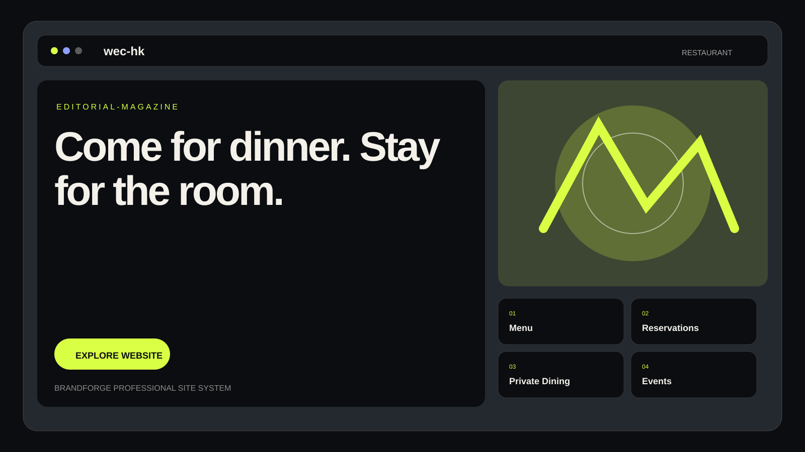

# wec-hk

> A hospitality-first restaurant experience with menu discovery, reservations, events, story and visit information.

## Overview

**wec-hk** is planned as a complete restaurant digital brand for guests planning dining experiences and special occasions.  
BrandForge will build the repository in ordered stages so the documentation exists before the website is published.

## Business profile

- **Brand:** wec-hk
- **Industry:** restaurant
- **Audience:** Guests planning dining experiences and special occasions
- **Tone:** warm
- **Commerce:** No
- **Content direction:** RESTAURANT / MENU / EXPERIENCE
- **Creative principle:** Hospitality should answer practical questions fast without losing the feeling of the place.

## Planned website

The website will be generated after this README passes the first publication stage.

1. Home
2. About
3. Services
4. Solutions
5. Stories
6. Resources
7. Support
8. Contact
9. Privacy
10. Terms

## Content system

The generated site will remain locked to the **restaurant** industry. BrandForge must not mix unrelated products, terminology or imagery from other industries.

Primary discovery paths:

- Menu
- Reservations
- Private Dining
- Events
- Drinks
- Visit

## Demo contact information

Until verified public business information is supplied, the prototype uses clearly marked demo contact data:

- **Email:** support@wec-hk.example
- **Phone:** +1 202-555-0168

These details are placeholders for demonstration and must not be represented as verified real-world contact information.

## Repository workflow

BrandForge publishes this project in the following order:

1. **README.md first** — complete project definition and repository documentation.
2. **Website second** — generate, validate and publish the full site.
3. **Repository completion third** — description, homepage, topics, support/security documents, issue templates and other missing GitHub fields.
4. **Profile completion last** — only fill blank public profile fields; existing user content is preserved.

## Quality rules

- No GitHub password is stored in this repository.
- No access token is written to generated files.
- Website generation must pass static QA before publication.
- Broken local assets block publication.
- Anti-clone checks reject overly similar website structures.
- Existing non-BrandForge repositories are never taken over.
- Existing GitHub profile content is preserved.
- Demo contact data remains explicitly labeled as demo.

## Status

**Stage 1: README prepared.**  
Website generation and GitHub completion follow only after this stage publishes successfully.

---

© 2026 wec-hk. Repository prepared by BrandForge Autopilot.
